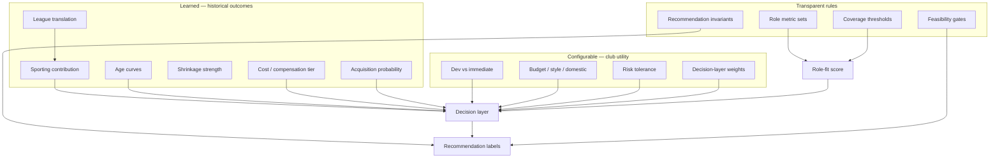

# Hybrid architecture — MLS Recruitment Intelligence

**Principle:** Learn what is likely to happen. Configure what a club should value. Use transparent rules when labels are scarce. Validate all three through historical backtesting.

A model can learn outcomes. It cannot objectively learn what a specific club should value without that club’s internal goals.



## Coefficient taxonomy

| Coefficient type | When to use | Examples | Override |
| --- | --- | --- | --- |
| **Learned** | Measurable historical outcome exists | Next-season g+, league movers, age curves, EB `m0`, cost tier, P(join MLS) | Retrain on time-split; never hand-tune as “truth” |
| **Configurable** | Club preference / policy | Dev vs win-now, budget, pressing vs possession, overall blend | User/club YAML + dashboard |
| **Transparent rules** | Insufficient labels or hard logic | Lower-cost invariants, role definitions, coverage gates | Code + `model_spec.yml`; tests required |

Learning every coefficient would likely make the product *worse*: unstable weights, multicollinearity, and fake objectivity over club utility.

---

## Model 1 — Sporting contribution (learned)

**Target options (choose one primary, report others):**

- Next-season Goals Added (or g+/96)
- Next-12-month contribution
- Future minutes × contribution rate
- Position-specific future performance
- Binary: becomes above-average MLS contributor

**Features:** shrunk/translated role metrics, age, position, source league, minutes, team context.

**Models:** Ridge / elastic net first; gradient boosting as comparison; hierarchical by position × source league when sample allows.

**Time split:**

| Split | Seasons |
| --- | --- |
| Train | through 2023 |
| Validate | 2024 |
| Test | 2025 |

For the **2026 live product**, train only on data available before the prediction cutoff.

**Status today:** Heuristic role-specific index until a fitted artifact exists under `data/processed/models/`.

---

## Model 2 — League translation (learned when movers exist)

For historical movers: pre-MLS performance → post-MLS performance.

$$
\text{MLS outcome} \sim \text{source metric} + \text{league} + \text{age} + \text{position} + \text{minutes} + \text{interactions}
$$

Until the mover sample is sufficient: **assumed league-strength adjustments** in `config/league_tiers.yml` (clearly labeled).

---

## Model 3 — Age curves (learned)

Fit separately: Forward, Winger/AM, CM, Fullback, CB, GK.

Methods: quadratic, splines, GAM, or mixed-effects with player effects.

Do **not** force every position to peak at 26.5.

**Fallback:** continuous priors in `model_spec.age_curves` until fitted.

Age is a **future-development** input, not current-performance evidence.

---

## Model 4 — Minutes reliability / shrinkage (learned)

Estimate prior strength \(m_0\) by how well period-\(t\) rates predict period-\(t+1\).

Different metrics need different shrinkage (shooting vs passing vs defensive vs goals).

**Fallback:** `m0 = 600` (features) / blend priors in `config.yml`.

---

## Model 5 — Cost / compensation (hybrid)

For players without known MLSPA compensation, estimate a **cost tier** from league, age, position, minutes, performance — never a precise transfer fee.

Known MLS guaranteed compensation remains observed (with as-of date).

---

## Model 6 — Acquisition probability (hybrid, harder)

Target: joined MLS within next window/year (yes/no), including non-movers.

Needs careful negatives and many unavailable variables. Until then: transparent feasibility heuristics + roster/contract constraints when available.

---

## Role-fit (expert set + optional learned weights)

1. Expert-defined metric set (`config/role_weights.yml`)
2. Learned weights **within that set** when enough role-labeled outcomes exist
3. Manual review that learned relationships make soccer sense
4. Coverage gates always apply (missing ≠ 50)

---

## Decision layer (configurable, transparent)

```
Recruitment priority = club_utility(
  expected contribution,   # Model 1
  role fit,                # expert + optional learned weights
  cost / value,            # observed or Model 5
  feasibility,             # hybrid Model 6
  development outlook,     # Model 3 + YoY
  uncertainty              # prediction intervals + coverage
)
```

Club profiles override public priors. There is **no** universal objectively correct blend.

Example policies (configurable, not learned as truth):

| Club type | Contribution | Role | Feasibility | Value | Upside |
| --- | --- | --- | --- | --- | --- |
| Win-now | 0.60 | 0.20 | 0.10 | 0.10 | — |
| Development | 0.35 | 0.25 | — | 0.15 | 0.25 |

Even if you later optimize weights for “successful MLS acquisitions three years later,” that learns **league-wide historical success**, not one club’s utility.

---

## Recommendation rules (never pure classifiers)

Labels such as Immediate upgrade / Developmental successor / Lower-cost alternative retain **logical invariants**.

Learned predictions feed the rules; a classifier must not override “target cost < incumbent” for Lower-cost.

---

## Artifacts & fallbacks

| Artifact | Path | Fallback |
| --- | --- | --- |
| Contribution model | `data/processed/models/contribution_ridge.rds` | Role-specific heuristic in `model_spec` |
| Translation model | `data/processed/models/league_translation.rds` | Assumed tier factors |
| Age curves | `data/processed/models/age_curves.rds` | `model_spec.age_curves` |
| Shrinkage | `data/processed/models/shrinkage_m0.json` | Config defaults |
| Cost tier | `data/processed/models/cost_tier.rds` | Unknown (not fabricated) |
| Feasibility | `data/processed/models/acquisition_prob.rds` | Transparent heuristic |

Registry: `config/model_spec.yml` → `hybrid` section.

---

## Validation (all three types)

Backtests in `scripts/run_backtests.R` / `scripts/08_train_learned_models.R`:

1. Contribution MAE/RMSE/rank corr by position  
2. League-mover calibration  
3. Shortlist success vs baselines  
4. Stability (bootstrap / perturbation)  
5. Decision-layer sensitivity (configurable weights change rank, not Model 1 scores)

Until validation passes: cautious language (Priority Review, Monitor, Development Watch, Low Priority).
